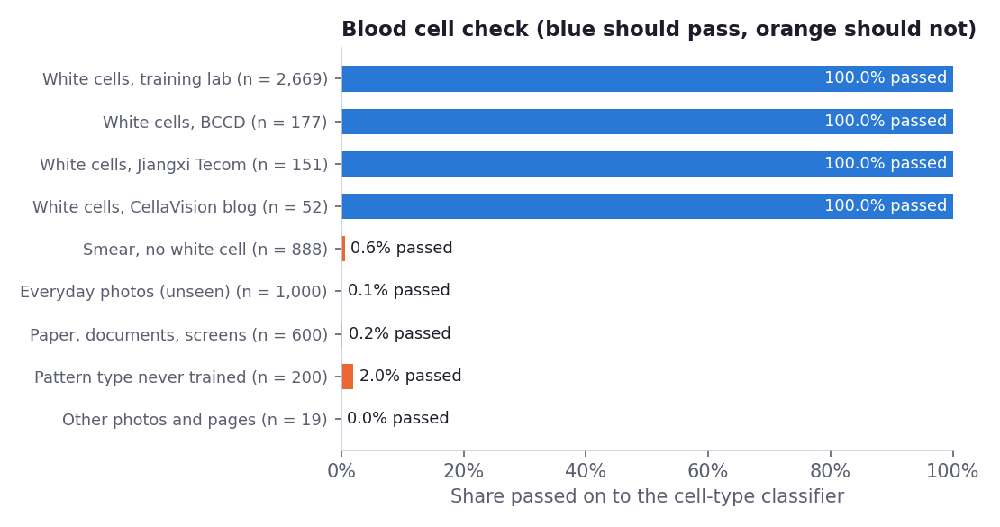
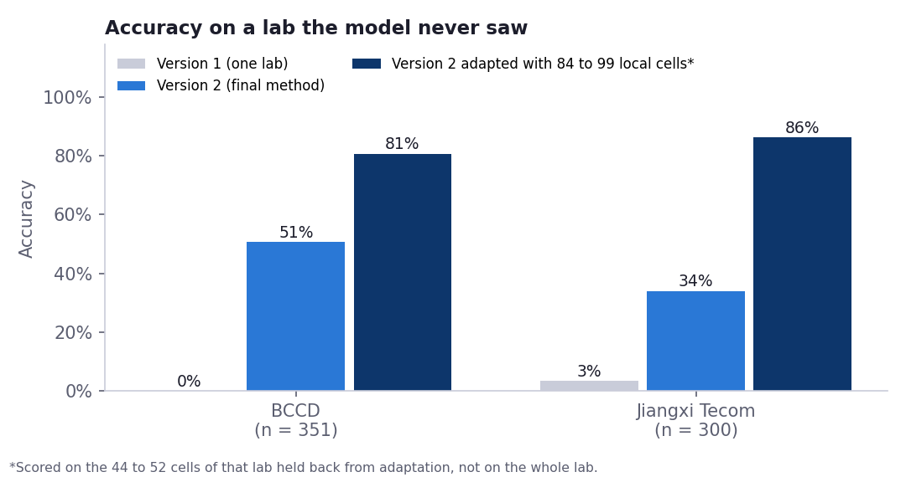
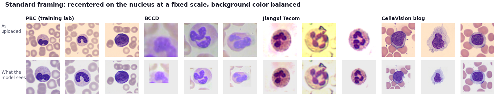

# Blood Cell Morphology Assistant

A Streamlit app that checks whether an image is a stained peripheral blood smear, finds the white cells in it, and classifies each one into seven types. It shows where in the cell the evidence sits, says when not to trust the answer, and can be adapted to a new laboratory with that lab's own labeled cells.

**Live app:** https://blood-cell-morphology-assistant.streamlit.app/
**Status:** research and teaching prototype. Not for clinical use (see [Disclaimer](#disclaimer)).


## What changed in version 2

Version 1 gave a cell type for anything. A photo of a black A4 sheet came back as an erythroblast. It was also trained on one lab only, and on labeled cells from three other sources it was right 0%, 3% and 30% of the time.

Version 2 changes four things:

1. **A blood cell check runs first.** A second small model decides whether the image is a stained white cell, a smear with no white cell, or not a blood smear at all. If it is not, the app gives no cell type. On held-out tests it passed 0.1% of everyday photos and 0.2% of paper, document and screen images, and refused the black A4 sheet.
2. **It finds cells in whole fields.** A color-based finder locates nuclei, and each cell is cut out, checked and classified on its own.
3. **It sees every cell the same way.** Each cell is recentered on its nucleus at a fixed scale, and the background color is balanced to the same gray, so a tight crop, a loose crop and a cut-out from a whole field reach the model in the same framing.
4. **It was trained on four sources, and you can add your own.** Training added labeled cells from three other sources to the original lab. A script adapts the model to your lab with your own labeled cells (about 3 minutes on 2 CPU cores in testing).

What did not change: on a lab it has never seen, the model is still wrong about half the time or more. The [results](#results) say how much, and [adapting it to your lab](#adapt-it-to-your-lab) is the fix that worked.

## Why I built it

I trained as a medical laboratory scientist in Ghana, and much of my bench time went into reading blood films: malaria microscopy, full blood counts and differential counts. A differential is slow, it depends on who is reading, and the hard calls are always the same few: a band neutrophil against a metamyelocyte, a large lymphocyte against a monocyte.

I wanted to see how a small image model handles those calls, and, more importantly, how it behaves when it is wrong. A model that scores 98% on its own test set can still be useless on slides from another lab. Version 1 proved that. So the part of this project I care most about is not the accuracy. It is the status line that tells you when to look for yourself, and the honest numbers for a lab the model has never seen.

## What the app does

- **Analyze an image.** Upload a cropped cell or a whole microscope field, or pick a sample: test-set cells, cells from another lab, whole fields, and images that are not blood cells (including the black A4 sheet). You get the cell type, a confidence score, the next two possibilities, a heatmap, and notes on what the cell looks like and why it matters.
- **Status line.** Every answer is marked *Confident*, *Check this cell yourself* (low confidence), *Unusual cell* (an unfamiliar-image check on the model's internal features), *No white cell*, or *Not a blood cell*.
- **Differential count.** Upload many images, or run the 120-cell demo batch. The count is reported the way a lab reports it: percentages over white cells only, nucleated red cells per 100 white cells, flags against typical adult ranges, and uncertain cells held back for review.
- **Session history.** Every cell you classify, side by side, with a CSV download.
- **Model performance.** The numbers below, read live from `reports/metrics`.
- **About and limits.** How it works, what it must not be used for, and how to adapt it.

It works at phone, tablet and desktop widths and uses system fonts. On a CPU, the blood cell check and the classifier each take a few milliseconds per cell (about 2 ms and 3 ms here).

## Results

### Refusing images that are not blood cells



| Images | Count | Passed on to the classifier |
|---|---|---|
| White cells, training lab test set | 2,669 | 100% |
| White cells, test halves of the three other sources | 380 | 100% |
| Smear patches with no white cell | 888 | 0.6% |
| Everyday photos never seen in training | 1,000 | 0.1% |
| Paper, documents, screens and noise (new generator seed) | 600 | 0.2% |
| A pattern type never used in training | 200 | 2.0% |
| Other photos, text pages and a histology image (scikit-image) | 19 | 0% |

The reported case and its relatives all got no cell type: a black A4 sheet in plain and warm light, a white sheet, a blue folder, a printed page, an app screenshot, everyday photos and noise. For the generated printed page, the check's top answer was "smear with no white cell" rather than "not a smear"; it still got no cell type. A version of the check trained without any BCCD images passed 93% of BCCD white cells, so on an unseen lab it can also refuse some real cells. The "2.0%" row is the weakest point: an image type nobody planned for can still get through.

### On a lab the model never saw

To estimate what happens at a new hospital, I trained two extra models, each with one lab left out completely, and scored them on every cell from that lab.



| Lab left out | Cells | Version 1 | Version 2 | 95% CI | Balanced accuracy |
|---|---|---|---|---|---|
| BCCD | 351 | 0.0% | 50.7% | 45.3% to 55.8% | 49.1% |
| Jiangxi Tecom (China) | 300 | 3.3% | 34.0% | 29.0% to 39.3% | 35.7% |

That is much better than version 1, and still not good enough to trust. The commonest mistake on both labs is neutrophils read as eosinophils: the model called 198 of the 351 BCCD cells eosinophils, and only 88 were. The Jiangxi Tecom slides use a rapid stain that is not a standard Romanowsky stain, which makes them the hardest case here.

**Confidence does not rescue it.** Answers the status line marked *Confident* were right 55% of the time on BCCD and 25% on Jiangxi Tecom, worse than the overall rate there. Answers above 90% confidence were right 68% and 51% of the time. The unfamiliar-image check flagged 25% and 40% of these cells. On a new lab, treat every answer as a suggestion until the model has been adapted.

### Adapting to a new lab

`scripts/finetune_local.py` takes a folder of labeled single-cell crops from your lab, holds back 30% of them for testing, uses a fifth of the rest to pick the best of six short epochs, trains on the remainder, and reports accuracy on the held-back cells before and after. I tested it by treating each left-out lab's training half as "your lab", starting from the model that had never seen that lab.

| Lab | Local cells trained on | Held-back cells | Accuracy before | Accuracy after | Balanced accuracy after | Time (2 CPU cores) |
|---|---|---|---|---|---|---|
| Jiangxi Tecom | 84 | 44 | 29.5% | 86.4% | 81.6% | 3.0 min |
| BCCD | 99 | 52 | 42.3% | 80.8% | 66.0% | 2.9 min |

The test sets are small, so read these as rough. Most of the gain is in neutrophils, the commonest cell. Rare types stayed weak or got worse: monocytes ended at 3 of 7 and 1 of 3 right, and on BCCD eosinophil recall fell from 77% to 54%. More cells of the rare types would probably help, but I have not tested how many. The final model, which trained on about 130 BCCD and 110 Jiangxi Tecom cells, scored 84.7% on the BCCD test half and 88.7% on the Jiangxi Tecom test half, which agrees with this.

### The training lab's test set

| Metric | Version 1 | Version 2 | Version 2, 95% CI |
|---|---|---|---|
| Accuracy | 98.4% | 93.7% | 92.8% to 94.6% |
| Balanced accuracy | 98.5% | 94.3% | 93.4% to 95.2% |
| Macro-F1 | 98.4% | 92.9% | 91.9% to 93.9% |
| Calibration error (ECE) | 0.5% | 1.5% | |

Version 2 is 4.6 points less accurate than version 1 on the lab version 1 was built for. That is the price of the augmentation and the other sources, and I chose to pay it: a model that is 98% right on one scanner and 0% right everywhere else is not useful to a hospital that does not own that scanner. The largest groups of errors are 38 neutrophils read as immature granulocytes (band neutrophil recall is 87.9%), and immature granulocytes read as monocytes (24) or basophils (23).


**The status line on this test set** held back 67 cells and caught 31 of the 168 mistakes. Cells marked *Confident* were right 94.7% of the time. The confidence level was set before testing as "send the least confident 2% of validation cells for review", and with this model that level is only 51%, so the status line catches less than it did in version 1.

### Other sources' held-out test halves

| Source | Test cells | Accuracy | 95% CI |
|---|---|---|---|
| BCCD | 177 | 84.7% | 79.7% to 89.8% |
| Jiangxi Tecom | 151 | 88.7% | 83.4% to 94.0% |
| CellaVision blog images | 52 | 61.5% | 48.1% to 75.0% |

Other cells from these sources were in training, so these numbers describe a lab the model has been adapted to, not a new one.

### Finding white cells in whole fields

On held-out fields with expert boxes, the finder found 184 of 184 white cells in BCCD photos (0.03 false alarms per image), 53 of 56 in draaslan images (no false alarms), and 294 of 300 in PBC images (no false alarms). "Found" means a detected nucleus center fell inside an expert box, and the PBC images hold one white cell each, so they are an easy case. The finder has no learned weights, but I tuned its rules on the other half of the same sources, and it was scored without the blood cell check that follows it in the app.

### Simulated phone photos through an eyepiece

I have no real phone photos, so I imitated them: a round field on a black surround, a color cast, noise, blur and JPEG compression. These are **simulated**, and real photos will differ.

- 150 PBC test images: none refused, a white cell classified in all of them, and 89.3% right, against 92.7% for the same 150 images unaltered.
- 79 BCCD test fields whose cells the classifier never trained on: one refused, a white cell classified in 70%, and in the other 29% the blood cell check rejected every cut-out the finder made.

### Where the model looks


The heatmap is a class activation map: the last feature maps weighted by the evidence for the chosen class. At 64 px input it is 8 x 8, so it shows roughly where the evidence is, not fine structure.

## How it works



1. **Trim.** A dark ring around the image (a phone photo through an eyepiece) is cropped away.
2. **Blood cell check.** A small CNN (0.3 M parameters) sorts the whole image into white cell, smear with no white cell, or not a smear. It was trained on white cells from all four sources, smear patches, CIFAR-10 photos and 3,000 generated sheets, documents, screens and patterns, with heavy augmentation. If the image is not a smear, the app stops.
3. **Find the cells.** For a field, nuclei are found by color (dark and blue over red and green), thresholded with Otsu's method, joined when they are lobes of one nucleus, and cut out with room for the cytoplasm. Each cut-out goes through the blood cell check again.
4. **Standardize.** Each cell is recentered on its nucleus, cropped to 2.4 times the nucleus size, and the background color is divided out. The same function builds the training arrays and runs in the app, and a test checks that they match exactly.
5. **Classify.** A four-block CNN (1.18 M parameters) at 64 x 64, exported to ONNX. Version 2 started from the version 1 weights and trained for 10 epochs on PBC plus three quarters of each other source's training half (the last quarter is for validation; each external cell repeated 10 times per epoch), with augmentation that imitates other stains (color deconvolution jitter), lamps, cameras, blur, JPEG, uneven lighting and the padding that tight crops get.
6. **Calibrate and decide the status.** Temperature scaling (T = 0.81), a review level (the least confident 2% of validation cells), and an unfamiliar-image check (Mahalanobis distance of pooled features, warning above the 99th percentile of validation distances), all set on validation data from all sources.

## Adapt it to your lab

You need Python 3.11 and the cells.

1. Crop single white cells from your images (one cell near the middle of each crop) and sort them into one folder per type:

   ```
   data/local/neutrophil/      data/local/lymphocyte/     data/local/monocyte/
   data/local/eosinophil/      data/local/basophil/       data/local/erythroblast/
   data/local/immature_granulocyte/
   ```

   Leave out types you have no cells for. Aim for at least 20 cells per type you include. Have the labels checked by a second reader if you can, because the model will learn your labels, errors included. Use crops with no patient names or numbers in them. `data/local/` and `models/local_*/` are in `.gitignore`, so your images and adapted models are not pushed to GitHub by accident.

2. Run:

   ```bash
   pip install -r requirements-dev.txt
   python scripts/finetune_local.py --images data/local --name mylab
   ```

   It prints accuracy on your held-back cells before and after, and saves the adapted model to `models/local_mylab/`.

3. Open the app with it:

   ```bash
   BLOODSMEAR_MODEL_DIR=models/local_mylab streamlit run app/streamlit_app.py
   ```

   Results then carry a line saying the model was adapted, and how it scored on your held-back cells.

So that it does not forget the original cells, the adapted model also trains on a replay set of 1,050 of them and is checked on 280 more (`models/train/replay_64c.npz`). To deploy it, copy the files from `models/local_mylab/` over those in `models/`.

## How I kept the evaluation honest

- **Leave-one-lab-out.** The unseen-lab numbers come from models that never saw a single cell from that lab, in training, validation or calibration.
- **Test halves kept apart.** Each external source was split 50/50 by class before training. The final model never saw the test halves. The app's samples from other labs and its whole-field samples all come from test halves.
- **Two decisions used unseen-lab data, and I say so.**
  - I compared three set-ups on the BCCD-left-out models and kept the best: the first attempt (from scratch, plain center crop), the kept set-up (standard framing, started from the version 1 weights), and the kept set-up plus stain-strength normalization. They scored 50.4%, 50.7% and 40.5% (`reports/metrics/v2_experiments.json`). That makes the 50.7% BCCD figure slightly optimistic. Jiangxi Tecom was not used for any choice, so 34.0% is the cleaner estimate.
  - The blood cell check's first acceptance rule (let 99% of validation cells through) hit its 0.9 ceiling and refused 26% of cells from the unseen lab (`reports/metrics/gate_first_rule_lolo_bccd.json`). I replaced it with a rule set from the other side: the lowest level at which at most 0.5% of validation images without a white cell get through. The rule hit its floor of 0.3.
- **The training lab's test set** was split off in version 1 and used only for final scoring. Model checkpoints were chosen on validation data (half PBC macro-F1, half accuracy on other sources' validation cells).
- **Simulated is labeled simulated.** No real phone photos were tested.
- **Version 1's history** is kept as it was in `models/v1`, `reports/metrics/v1`, `reports/figures/v1` and `notebooks/v1_single_lab_analysis.ipynb`, including the batch-norm fix and the confidence-rule change described in [`docs/decisions.md`](docs/decisions.md).

## Project structure

```
blood-cell-morphology-assistant/
├── app/
│   ├── streamlit_app.py          # the app: five tabs
│   └── ui.py                     # CSS layer, Altair charts, field annotation
├── src/bloodsmear/
│   ├── config.py                 # classes, morphology notes, reference ranges, paths
│   ├── preprocess.py             # loading, center crop, eyepiece-border trim
│   ├── canonical.py              # standard framing: recenter on the nucleus, balance the background
│   ├── detect.py                 # finds white cells in a whole field
│   ├── inference.py              # blood cell check, classifier, calibration, status, field analysis
│   ├── explain.py                # class activation map and overlay
│   ├── quality.py                # image checks (size, exposure, contrast, color)
│   └── differential.py           # turns per-cell results into a differential
├── scripts/
│   ├── prepare_data.py           # PBC: label checks, duplicates, split, arrays, samples
│   ├── prepare_external.py       # other labs, blood cell check data, whole fields
│   ├── prepare_canonical.py      # classifier arrays in the standard framing
│   ├── augment.py                # stain, lamp, camera and padding augmentation
│   ├── train.py                  # the classifier (CNN, or MobileNet for experiments)
│   ├── train_gate.py             # the blood cell check
│   ├── run_training_v2.sh        # the version 2 training runs, in order
│   ├── evaluate_v2.py            # unseen labs, final test, whole app, ONNX export
│   ├── evaluate_finder.py        # the cell finder on held-out fields
│   ├── finetune_local.py         # adapt the model to your lab
│   ├── make_figures_v2.py        # figures for this README
│   ├── screenshots.py            # app screenshots with Playwright
│   └── evaluate.py, make_figures.py, build_notebook.py, run_training.sh   # version 1
├── models/
│   ├── bloodcell_cnn.onnx        # the classifier (4.7 MB)
│   ├── gate.onnx                 # the blood cell check (1.2 MB)
│   ├── model_aux.npz, model_meta.json
│   ├── train/                    # Keras weights and replay set for finetune_local.py
│   ├── candidates/               # training logs
│   └── v1/                       # version 1, unchanged
├── data/
│   ├── manifest.csv, manifest_external.csv, fields.json
│   ├── samples/                  # sample images for the app
│   ├── demo_batch/               # 120 test-set cells for the differential demo
│   ├── external/                 # BCCD crops used by version 1's check
│   └── DATA_CARD.md
├── reports/
│   ├── figures/                  # version 2 figures (version 1 in figures/v1)
│   ├── metrics/                  # every number in this README, as JSON
│   └── MODEL_CARD.md
├── notebooks/v1_single_lab_analysis.ipynb
├── tests/                        # 45 tests: preprocessing, framing, data, models, refusals, finder, app
├── docs/decisions.md, docs/screenshots/
├── requirements.txt              # what the deployed app needs
└── requirements-dev.txt          # plus training, evaluation and tests
```

## Run it yourself

```bash
git clone https://github.com/onipayedejohn/blood-cell-morphology-assistant.git
cd blood-cell-morphology-assistant
python -m venv .venv && source .venv/bin/activate      # Windows: .venv\Scripts\activate
pip install -r requirements.txt
streamlit run app/streamlit_app.py
```

The trained models are in `models/`, so the app runs without retraining.

To rebuild everything from the raw data (the downloads go in `data/raw/`; about 5 hours on 2 CPU cores):

```bash
pip install -r requirements-dev.txt
git clone --depth 1 https://github.com/medmabcf/White-Blood-Cell-Detection-Dataset.git data/raw/pbc
git clone --depth 1 https://github.com/Shenggan/BCCD_Dataset.git data/raw/bccd
git clone --depth 1 https://github.com/apple2373/BCCD.git data/raw/bccd_labeled
git clone --depth 1 https://github.com/zxaoyou/segmentation_WBC.git data/raw/zheng
git clone --depth 1 https://github.com/draaslan/blood-cell-detection-dataset.git data/raw/draaslan
git clone --depth 1 https://github.com/YoongiKim/CIFAR-10-images.git data/raw/cifar
python scripts/prepare_data.py
python scripts/prepare_external.py
python scripts/prepare_canonical.py
bash scripts/run_training.sh          # version 1, whose weights version 2 starts from
bash scripts/run_training_v2.sh
python scripts/evaluate_v2.py
python scripts/evaluate_finder.py
python scripts/make_figures_v2.py
pytest
```

**Deploying on Streamlit Community Cloud:** push the repo to GitHub, create an app, and set the main file path to `app/streamlit_app.py`. Keep the versions in `requirements.txt` as they are.

## Limitations

- **Not tested on your laboratory.** On two labs it never saw, it was right 51% and 34% of the time. Adapt it before relying on it.
- **Phone photos are untested.** Only simulated ones were checked.
- **Normal cells only.** Blasts, atypical or reactive lymphocytes, malaria parasites, sickle cells and other abnormal findings are not classes. The model will force them into one of the seven, though some get marked as unusual.
- **Five classes outside the training lab.** None of the other sources has erythroblasts or immature granulocytes, so those two classes have only been learned from one lab.
- **The blood cell check can be wrong.** It passed 2% of one image type it had never seen, and it can refuse real cells from an unfamiliar lab.
- **No patient split.** The PBC data has no patient identifiers, so test cells may share donors with training cells.
- **Labels not re-read.** I used the external labels as published; some BCCD labels are known to be noisy.
- **No platelets.** The version of the PBC data used here does not include them.
- **Percentages only, and generic ranges.** Flags compare each type's share of white cells against typical adult ranges from mostly Western populations. Many healthy people of West African ancestry have lower neutrophil counts (Duffy-null associated neutrophil count). Use local ranges.

## Disclaimer

This is a research and teaching prototype. It is not a medical device, has not been reviewed by any regulator, and has not been tested in a clinical laboratory. Do not use it to make decisions about patients, and do not upload images that contain patient names or identifiers.

## Data, credits and licence

- **Training lab (PBC):** Acevedo A, Merino A, Alférez S, Molina Á, Boldú L, Rodellar J. *A dataset of microscopic peripheral blood cell images for development of automatic recognition systems.* Data in Brief 30 (2020) 105474. https://doi.org/10.1016/j.dib.2020.105474. CC BY 4.0, via https://github.com/medmabcf/White-Blood-Cell-Detection-Dataset. The replay set in `models/train/` holds 1,330 of these images (at 64 px, in the standard framing).
- **Other labs:**
  - BCCD, https://github.com/Shenggan/BCCD_Dataset (MIT), with subtype crops from https://github.com/apple2373/BCCD.
  - Zheng X, Wang Y, Wang G, Liu J. *Fast and robust segmentation of white blood cell images by self-supervised learning.* Micron 107 (2018) 55–71. Images from Jiangxi Tecom Science Corporation, China, and from the CellaVision blog, via https://github.com/zxaoyou/segmentation_WBC (GPL-3.0). These images are not copied into this repository.
- **Whole fields:** draaslan blood cell detection dataset, https://github.com/draaslan/blood-cell-detection-dataset (MIT).
- **Not-blood images:** CIFAR-10 (Krizhevsky A, 2009), via https://github.com/YoongiKim/CIFAR-10-images, and scikit-image's bundled sample images.
- **Methods:**
  - Zhou B, et al. *Learning Deep Features for Discriminative Localization.* CVPR 2016 (class activation maps).
  - Guo C, et al. *On Calibration of Modern Neural Networks.* ICML 2017 (temperature scaling).
  - Lee K, et al. *A Simple Unified Framework for Detecting Out-of-Distribution Samples and Adversarial Attacks.* NeurIPS 2018 (Mahalanobis distance).
  - Wu Y, Johnson J. *Rethinking "Batch" in BatchNorm.* 2021 (precise batch norm).
  - Ruifrok AC, Johnston DA. *Quantification of histochemical staining by color deconvolution.* Anal Quant Cytol Histol 23 (2001) 291–299 (stain augmentation).
- **Code:** MIT licence.
