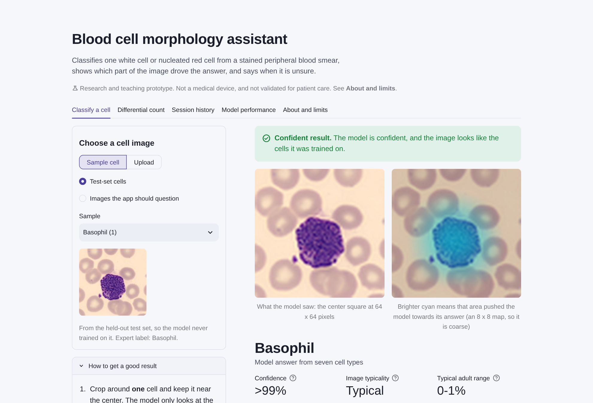
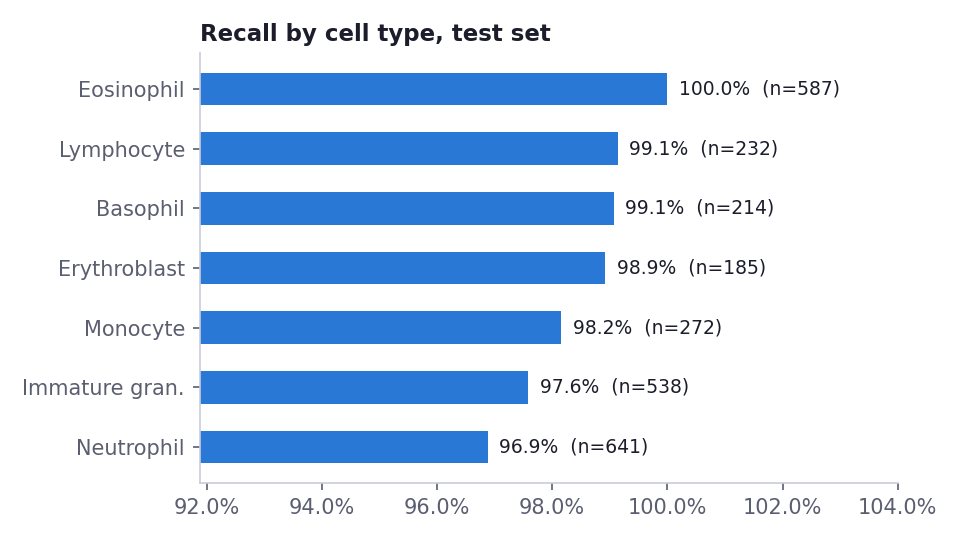
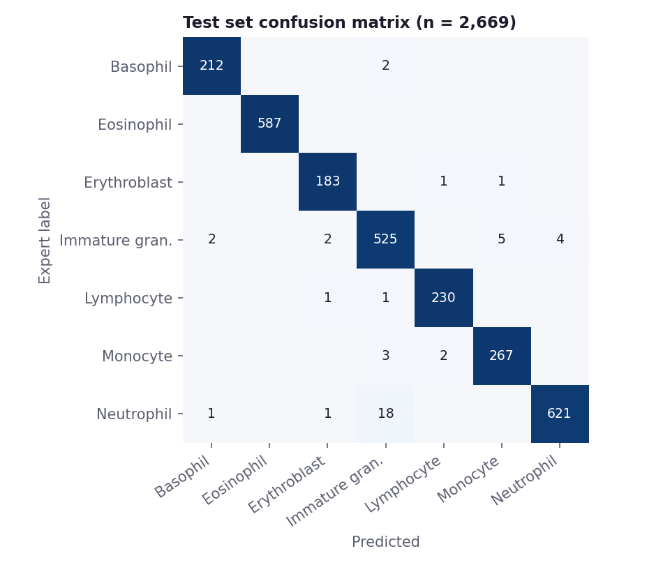
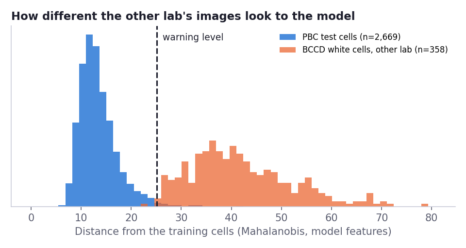
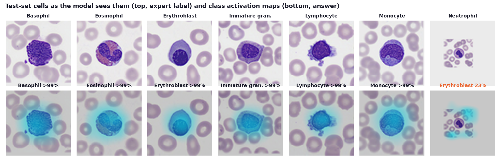

# Blood Cell Morphology Assistant

A Streamlit app that classifies one cell from a stained peripheral blood smear into seven types, shows where in the image the evidence sits, and tells you when not to trust the answer.

**Live app:** https://blood-cell-morphology-assistant.streamlit.app/
**Status:** research and teaching prototype. Not for clinical use (see [Disclaimer](#disclaimer)).



## Why I built it

I trained as a medical laboratory scientist in Ghana, and much of my bench time went into reading blood films: malaria microscopy, full blood counts and differential counts. A differential is slow, it depends on who is reading, and the hard calls are always the same few: a band neutrophil against a metamyelocyte, a large lymphocyte against a monocyte.

I wanted to see how a small image model handles those calls, and, more importantly, how it behaves when it is wrong. A model that scores 98% on its own test set can still be useless on slides from another lab. So the part of this project I care most about is not the accuracy. It is the status line that tells you when to look for yourself.

## What the app does

- **Classify a cell.** Upload a cropped cell, or pick one of 21 test-set cells. You get the cell type, a confidence score, the next two possibilities, a heatmap of where the evidence sits, and short notes on what the cell looks like and why it matters clinically.
- **Status line.** Every answer is marked *Confident*, *Check this cell yourself* (low confidence), or *This image does not look like the training images* (an unfamiliar-image check on the model's internal features).
- **Differential count.** Upload many single-cell images, or run the 120-cell demo batch. The count is reported the way a lab reports it: percentages over white cells only, nucleated red cells per 100 white cells, flags against typical adult ranges, and uncertain cells held back for review instead of counted.
- **Session history.** Every cell you classify, side by side, with a CSV download.
- **Model performance.** Test metrics with confidence intervals, recall by cell type, the confusion matrix, calibration, the trade-off between answering fewer cells and getting more right, the model comparison, and the other-lab check.
- **About and limits.** What the model is, how it works, and what it must not be used for.

It works on phone, tablet and desktop widths, uses system fonts, and takes about 2 ms per cell on a CPU.

## Results

Locked test set: **2,669 images**, split off before training and used only for final scoring. It was scored twice, before and after the confidence-rule change described below; the model and these numbers did not change between the two.

| Metric | Value | 95% CI (bootstrap) |
|---|---|---|
| Accuracy | 98.4% | 97.8% to 98.8% |
| Balanced accuracy | 98.5% | 98.0% to 99.0% |
| Macro-F1 | 98.4% | 97.9% to 98.9% |
| Calibration error (ECE) | 0.5% (0.4% before temperature scaling) | |

Recall ranges from 96.9% (neutrophils) to 100% (eosinophils). The largest group of the 44 errors (18) is neutrophils read as immature granulocytes, 16 of them band forms. That is the band-versus-metamyelocyte boundary, which is also where people disagree on a real smear.




### What the status line catches, and what it misses

On the test set the status line held back 98 of 2,669 cells (70 for low confidence, 30 as unfamiliar, 2 of them both) and caught 25 of the 44 mistakes. Cells marked *Confident* were right 99.3% of the time. But **19 mistakes were still marked Confident, 10 of them above 90% confidence.** The status line lowers the error rate on accepted cells; it does not replace a person looking at the slide.

### The result that matters more: images from another lab

I tested the app on 358 white cells from the BCCD dataset, photographed in a different lab with a different stain and camera. BCCD has no subtype labels, so I cannot report accuracy there. What I can show is what the model said: it called **302 of them immature granulocytes and 50 erythroblasts**, with a median confidence of 99.9% (83% of them above 90%). On a real smear that would read as a severe left shift that is not there.

The unfamiliar-image check flagged **99.7%** of those cells, and every red-cell-only field, noise image and blank field, while flagging only **1.1%** of test cells from the training lab.



So the model is accurate on images like its training data, and confidently wrong on images that are not. That is why the app shows the status line first and the answer second.

### Three models compared on validation data

| Model | Validation macro-F1 | Parameters | Training time (2 CPU cores) | Energy |
|---|---|---|---|---|
| Logistic regression on 24 x 24 pixels | 0.779 | 12,103 | 0.3 min | 0.07 Wh |
| **CNN, 64 x 64 input (chosen)** | **0.992** | 1.18 M | 40 min | 10.8 Wh |
| CNN, 112 x 112 input | 0.991 | 0.66 M | 76 min | 20.8 Wh |

I fixed the selection rule before training: keep the 112 px model only if it beats 64 px by more than 0.005 macro-F1. It did not, so I kept the 64 px model, which needs about 40% less computation per image and used half the training energy. The higher resolution did not improve validation macro-F1.

### Where the model looks



The heatmap is a class activation map: the network's last feature maps weighted by the evidence for the chosen class. At 64 px input that map is 8 x 8, so it shows roughly where the evidence is (on the cell, not the background), not fine structure.

More figures are in [`reports/figures`](reports/figures): training curves, calibration, the coverage trade-off, and the most confident mistakes. The whole analysis is walked through, with outputs, in [`notebooks/blood_cell_analysis.ipynb`](notebooks/blood_cell_analysis.ipynb).

## How it works

1. **Preprocess.** Crop the center square, resize to 64 x 64 with Lanczos filtering. The same function builds the training arrays and runs in the app. A test re-runs it on 25 raw images at both sizes and checks the arrays match exactly (it needs the raw download, so it skips on a fresh clone).
2. **Classify.** A four-block CNN trained from scratch with TensorFlow/Keras, exported to ONNX. The app runs it with ONNX Runtime, so it does not need TensorFlow.
3. **Calibrate.** Temperature scaling fitted on validation logits (T = 0.92). The model was already well calibrated, so this changed little.
4. **Explain.** The ONNX model returns its last feature maps as a second output. The app weights them by the dense layer for the predicted class to draw the heatmap.
5. **Decide the status.** Confidence must reach 81%, the level that sends the least confident 2% of validation cells for review. The image's pooled features must sit within the 99th percentile of validation distances (Mahalanobis, class-conditional means, Ledoit-Wolf shared covariance).

## How I kept the evaluation honest

- **Labels checked.** Every label was checked against its filename prefix before use.
- **Duplicates kept together.** 14 pairs of identical images were found (8 of them crossed the source copy's own train/val/test split), and each pair now stays inside one split. One pair carries conflicting labels, band neutrophil and eosinophil; it is in the training set and is listed in the data card.
- **Locked test set.** The 20% test set was split off first, stratified by class, and used only for final scoring, which happened twice (see the last point in this list). Model choice, the temperature and the unfamiliar-image level were set on validation data before the test set was used. The confidence level was also set on validation data, but its rule was changed after the first test run.
- **Batch norm fixed.** The first training run looked broken: training loss fell while validation macro-F1 was 0.02 for three epochs and 0.10 at epoch 4. The weights were fine. The batch-norm running averages had drifted on augmented batches, and recomputing them on clean images took the same epoch-4 weights to 0.96. These figures are from my debugging session; that run's log and checkpoint were overwritten by the retraining. The details are in [`docs/decisions.md`](docs/decisions.md).
- **One rule changed after the test run, and I say so.** My first confidence rule (the lowest level at which accepted validation cells were 99% correct) landed at the bottom of its search range, 40%, where it held back nothing. I saw that in the first test run and replaced it with a review budget set on validation: send the least confident 2% for review. The status-line numbers above use the new rule, so they are not a fully clean held-out estimate. The model, the temperature and the unfamiliar-image level did not change.

## Project structure

```
blood-cell-morphology-assistant/
├── app/
│   ├── streamlit_app.py        # the app: five tabs
│   └── ui.py                   # small CSS layer and Altair charts
├── src/bloodsmear/
│   ├── config.py               # classes, morphology notes, reference ranges, paths
│   ├── preprocess.py           # the one preprocessing function (training and app)
│   ├── inference.py            # ONNX model, calibration, unfamiliar-image check
│   ├── explain.py              # class activation map and overlay
│   ├── quality.py              # image checks (size, exposure, contrast, color)
│   └── differential.py         # turns per-cell results into a differential
├── scripts/
│   ├── prepare_data.py         # label checks, duplicates, split, arrays, samples
│   ├── train.py                # one CNN candidate, with precise batch norm
│   ├── run_training.sh         # trains both candidates
│   ├── evaluate.py             # select, calibrate, test once, export ONNX
│   ├── make_figures.py         # figures for this README
│   ├── build_notebook.py       # writes and executes the notebook
│   └── screenshots.py          # app screenshots with Playwright
├── models/
│   ├── bloodcell_cnn.onnx      # the deployed model (4.7 MB)
│   ├── model_aux.npz           # heatmap weights and unfamiliar-image statistics
│   ├── model_meta.json         # input size, temperature, thresholds, versions
│   └── candidates/             # training logs for both CNNs
├── data/
│   ├── manifest.csv            # every image: class, subtype, split, duplicate group
│   ├── samples/                # test-set cells and questionable images for the app
│   ├── demo_batch/             # 120 test-set cells for the differential demo
│   ├── external/               # BCCD crops from another lab
│   └── DATA_CARD.md
├── reports/
│   ├── figures/
│   ├── metrics/                # every number in this README, as JSON
│   └── MODEL_CARD.md
├── notebooks/blood_cell_analysis.ipynb
├── tests/                      # 31 tests: preprocessing, data, model, differential, app
├── docs/decisions.md, docs/screenshots/
├── .streamlit/config.toml
├── requirements.txt            # what the deployed app needs
└── requirements-dev.txt        # plus training, evaluation and tests
```

## Run it yourself

```bash
git clone https://github.com/onipayedejohn/blood-cell-morphology-assistant.git
cd blood-cell-morphology-assistant
python -m venv .venv && source .venv/bin/activate      # Windows: .venv\Scripts\activate
pip install -r requirements.txt
streamlit run app/streamlit_app.py
```

The trained model is in `models/`, so the app runs without retraining.

To rebuild everything from the raw data:

```bash
pip install -r requirements-dev.txt
git clone --depth 1 https://github.com/medmabcf/White-Blood-Cell-Detection-Dataset.git data/raw/pbc
git clone --depth 1 https://github.com/Shenggan/BCCD_Dataset.git data/raw/bccd
python scripts/prepare_data.py      # about 3 minutes
bash scripts/run_training.sh        # about 2 hours on 2 CPU cores
python scripts/evaluate.py          # scores the test set once and exports ONNX
python scripts/make_figures.py
pytest                              # 31 tests
```

**Deploying on Streamlit Community Cloud:** push the repo to GitHub, create a new app, and set the main file path to `app/streamlit_app.py`. Keep the versions in `requirements.txt` as they are.

## Limitations

- **One lab, one scanner.** All training images came from one hospital's CellaVision DM96. As the BCCD check shows, images from other labs are often classified wrongly with high confidence. The status line catches most of them, not necessarily all.
- **Normal donors.** Blasts, atypical or reactive lymphocytes, malaria parasites, sickle cells and other abnormal findings are not classes. The model will force them into one of the seven.
- **One cell per image.** It does not find cells on a whole smear.
- **No patient split.** The dataset has no patient identifiers, so test cells may come from the same people as training cells. Results on new patients are likely to be lower.
- **No platelets.** The version of the dataset used here does not include them.
- **Percentages only.** Flags compare each cell type's share of white cells, not absolute counts, because the app has no total white cell count.
- **Generic reference ranges.** The differential uses typical adult ranges from mostly Western populations. Many healthy people of West African ancestry have lower neutrophil counts (Duffy-null associated neutrophil count). Use local ranges.

## Disclaimer

This is a research and teaching prototype. It is not a medical device, has not been reviewed by any regulator, and has not been tested in a clinical laboratory. Do not use it to make decisions about patients, and do not upload images that contain patient names or identifiers.

## Data, credits and licence

- **Training data:** Acevedo A, Merino A, Alférez S, Molina Á, Boldú L, Rodellar J. *A dataset of microscopic peripheral blood cell images for development of automatic recognition systems.* Data in Brief 30 (2020) 105474. https://doi.org/10.1016/j.dib.2020.105474. CC BY 4.0. I used the version with cell boxes at https://github.com/medmabcf/White-Blood-Cell-Detection-Dataset.
- **Other-lab images:** BCCD dataset, https://github.com/Shenggan/BCCD_Dataset (MIT).
- **Methods:**
  - Zhou B, et al. *Learning Deep Features for Discriminative Localization.* CVPR 2016 (class activation maps).
  - Guo C, et al. *On Calibration of Modern Neural Networks.* ICML 2017 (temperature scaling).
  - Lee K, et al. *A Simple Unified Framework for Detecting Out-of-Distribution Samples and Adversarial Attacks.* NeurIPS 2018 (Mahalanobis distance).
  - Wu Y, Johnson J. *Rethinking "Batch" in BatchNorm.* 2021 (precise batch norm).
- **Code:** MIT licence.
